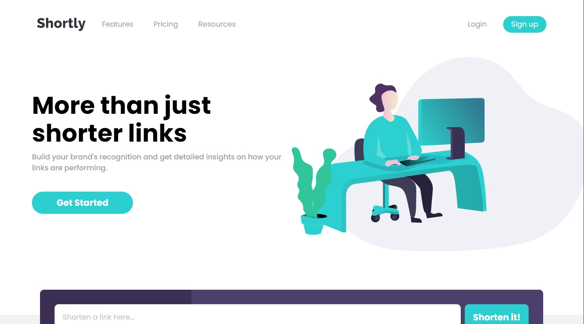

# Frontend Mentor - Shortly URL shortening API Challenge solution

This is a solution to the [Shortly URL shortening API Challenge challenge on Frontend Mentor](https://www.frontendmentor.io/challenges/url-shortening-api-landing-page-2ce3ob-G). Frontend Mentor challenges help you improve your coding skills by building realistic projects. 

## Table of contents

- [Overview](#overview)
  - [The challenge](#the-challenge)
  - [Screenshot](#screenshot)
  - [Links](#links)
- [My process](#my-process)
  - [Built with](#built-with)
  - [What I learned](#what-i-learned)
  - [Continued development](#continued-development)
- [Author](#author)

## Overview

### The challenge

Users should be able to:

- View the optimal layout for the site depending on their device's screen size
- Shorten any valid URL
- See a list of their shortened links, even after refreshing the browser
- Copy the shortened link to their clipboard in a single click
- Receive an error message when the `form` is submitted if:
  - The `input` field is empty

### Screenshot

### Links

- Solution URL: (https://www.frontendmentor.io/solutions/shortly-url-shortener-using-vanilla-javascript-sass-and-gulp-gci3TPanLg)
- Live Site URL: (https://roonderurlshrtnr.netlify.app/)

## My process

### Built with

- Semantic HTML5 markup
- CSS custom properties
- Flexbox
- CSS Grid
- Mobile-first workflow
- JavaScript ES6
- Gulp [https://gulpjs.com/] - Node.js Toolkit
- Node.js [https://nodejs.org/es/] - JavaScript Enviroment

### What I learned

This project helped me a lot to keep learning on my layout skills in this kind of web apps. More than that, it helped me out on practicing better my Fetch API skills, using the Async Await techniques.

### Continued development

With this practices, I'll be keep improving on my layout, and API, skills. Trying to work on a REST API project in the future, or doing an even complex project for layouts.

## Author

- Website - [Roonder](https://github.com/Roonder)
- Frontend Mentor - [@roonder](https://www.frontendmentor.io/profile/Roonder)
- LinkedIn - [@roonderdev](https://www.linkedin.com/in/roonderdev/)
